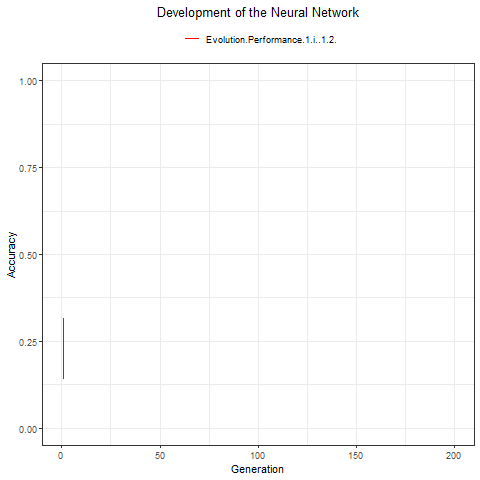

```{r setup, include=FALSE}
knitr::opts_chunk$set(echo = TRUE)
```

## Introduction

In order for me to get a better understanding of the neural network and how it works, I have created this exercise. The exercise is simple, build a classifier from scratch using a neural network. In this exercise, I will optimize the neural network using an evolutionary method as the learning algorithm. I will save gradient descent and backpropagation for a later exercise. 

## The structure

* Data and Data Preparations
* Creating the model - Neuroevolution of Neural Networks
* Train the model. 
* Evaluate the model.

## Data and Data Preperation

### Select and Examine the Data
Importing the ["Zoo"](https://archive.ics.uci.edu/ml/datasets/Zoo) data set containing information about different animals. The data set consists of 18 variables, the animal name, and the type and 16 features. All features are binary, except for the "legs" variable which is nominal with 6 categories. There are 7 animal types/classes and after some training, the classifier should be able to sort the animals into the right class based on the features.    

```{r zoo}
# loading the necessary packages
rm(list=ls(all=t))
set.seed(1)
library(readr)
library(compiler)
library(dplyr)
library(ggplot2)
library(reshape2)
library(animation)

#import dataset
zoo <- read.csv("zoo.txt", header=T)

# have a look at the data structure
str(zoo)
head(zoo)

#remove the first column (animal_name)
Data<-zoo[,-1]

#Have a look at how well each class is represented. Is the data set imbalanced?
table(zoo$type)
```
###Preprocess and Tranform Data
Under this section, I need to consider if it is necessary to format, clean, scale etc. the data set. Looking at the table showing the number each class is represented, it's clear that the data set is imbalanced. Class 1 appear way more than the rest of classes. Also, classes such as 3,4 and 6 is underrepresented. I will use the oversampling method to fix this problem. 
```{r, Data}
#Making a function to handle the balancing.
BalanceDataset<-function(Dataset){
  #set all variables to numeric
  Dataset<-sapply(Dataset,as.numeric)
  #frequency table
  n <- table(Dataset[,ncol(Dataset)])
  # convert it to a dataframe
  class<- data.frame(n)
  # Set number of instances for each class equal to the most represented class.
  instances<-max(class$Freq)
  # over sample the dataset such each class is equally represented. 
  along<-as.numeric(class$Var1)
  ind <- unlist(lapply(along, function(i){
    sample(which(Dataset[,ncol(Dataset)]==levels(class$Var1)[i]),size = instances, replace = T)
  }))
  
  #returns a dataset of length = instances*number of classes 
  Dataset[ind,]
}

#Balancing the dataset, such that each class is equally represented in the dataset. 
Data_Balanced <- BalanceDataset(Data)

#having a look at the data after I have balanced it by using the oversampling method.
table(Data_Balanced[,ncol(Data_Balanced)])

```

### Selecting the Training and Test Data
Now I will split the data in two, one used for training and one for evaluating the model. The most common way is to use a 70/30 split, so I will do the same. With larger data sets, one can use a smaller fraction for the test set. 
```{r Data_Balanced}
#Split the data set into training and testing data. 70%/30%
ind <- sample(1:(nrow(Data_Balanced)), size = floor((nrow(Data_Balanced))*0.7),replace = F)
TrainData<- Data_Balanced[ind,]

TestData<- Data_Balanced[-ind,]

#class representation traindata
table(TrainData[,ncol(TrainData)])

#class representation testdata
table(TestData[,ncol(TestData)])
``` 

## Neuroevolution of Neural Networks, Set-Up

Now it's time to create the building blocks for the model. It can be structured as follows:

The neural network part:

* Create a neural network.
* Create a population of neural networks.
* Propagate forward through the network to generate output values
* Calculate performance
 
The evolution part:

* Fitness function.
* Selection. 
* Genetic operations (crossover and mutuation)
* Breed a new generation population of neural networks. 

### Neural Network
Making a function to create a neural network and initialize its weigths and biases and then use this function to create another function that initializes the population of neural networks.

The inputs are:

* NI = Number of inputs/numbers of predictors/features
* NH = number of hiddin layers
* NprH = number of neurons pr hidden layer
* BO = number of outputs/ number of classes to predict
* Size = Population size
```{r}
# Creating the Neural Network structure
NNStructure <- cmpfun(function(NI,NH,NprH,NO){
  
  #the number of neurons in each layer
  struc <- c(NI,rep(NprH,NH),NO)
  
  # number of weights for each neuron
  W_lengths <- struc[1:(length(struc)-1)]
  
  # Bias for each neuron
  B_lengths <- struc[-1]
  
  # initialize the biases
  B <- lapply(seq_along(W_lengths), function(x){
    sb <- abs(rnorm(1,0,1))
    r <- B_lengths[[x]]
    matrix(rnorm(r,0,sb), nrow=r, ncol=1)
  } )
  
  # initialize weights
  W <- lapply(seq_along(B_lengths), function(x){
    sw <- abs(rnorm(1,0,1.5))
    r <- B_lengths[[x]]
    c <-W_lengths[[x]]
    matrix(rnorm(n=r*c,0,sw), nrow=r, ncol=c)
  })
  
  return(list(W=W,B=B))
})

#initialize population of neural networks
initializePop <- cmpfun(function(size,NI,NH,NprH,NO){
  #create population
  pop<-lapply(1:size, function(X) NNStructure(NI,NH,NprH,NO))
  return(pop)
})


```

###Propagate Forward
Start by creating the activation function. I will use the sigmoid. This function will be used in the feedforward function. 

The feedforward function goes through the network layer-by-layer and calculates the output of the activation function. Formally the activation for layer $l$ can be written as:

$$a^{l}= \sigma\left(w^{l}*a^{l-1} + b^{l}\right)$$

Use the feedforward function to create a function that makes predictions and return a matrix containing the predictions and the actual classes. Then this used to calculate the performance of the model. Accuracy is used as the performance measure in this exercise.

```{r}
# Activation function
sigmoid <-function(x){
  return(1/(1+exp(-x)))
}

#Feedforward Function
FeedForward<- cmpfun(function(W,B,a){
  
  for (i in seq_along(W)){
    a <- matrix(a, nrow=length(a), ncol=1)
    b <- B[[i]]
    w <- W[[i]]
    w_a <- w%*%a
    bias <- matrix(b, nrow=dim(w_a)[1], ncol=dim(w_a)[-1])
    a <- sigmoid(w_a + bias)
  }
  return(a)
})

#Runs the network
RunNetwork <- cmpfun(function(TrainData,NetStruct){
  
  TrainData <- as.matrix(TrainData)
  W=NetStruct$W
  B=NetStruct$B
  
  #Creates a matrix of prediction vs actual
  result <- t(sapply(1:nrow(TrainData), function(i){
    a <-t(TrainData[i, 1:(ncol(TrainData))-1])
    pred<- which.max(FeedForward(W,B,a))
    actual <- TrainData[i,ncol(TrainData)]
    matrix(c(pred,actual))
  }))

  return(result)
})


# Performance: Accuracy of the predictions
Accuracy <- cmpfun(function(Population,TrainData){
  # sum(diag(RunNetwork(as.matrix(TrainData),Population)))/sum(RunNetwork(as.matrix(TrainData),Population))
  d<-RunNetwork(as.matrix(TrainData),Population)
  sum(ifelse(d[,1]==d[,2],1,0))/nrow(d)
})

```

### Genetic Algorithm Used to Evolve the Networks

The networks in the population are given a fitness score based on their performance. The best fitted networks are selected and will be used to breed a new population of neural networks. In the code block below, one will find the functions for handling the fitness calculation, selection, crossover and mutation, and breeding.

```{r}
# fitness function
Fitness_score <- cmpfun(function(Population,TrainData){
  
  score <- unlist(lapply(Population, FUN=Accuracy,
                         TrainData = as.matrix(TrainData)
  ))
  
  return(score)
})

#mutation function
mutate <- cmpfun(function(dna, changeR){
  r<- runif(1,0,1)
  if(r>=0.6){
    #Amplifies the the weight/bias
    dna<-dna + rnorm(length(dna),dna,changeR)
  }else if(r>=0.2){
   # +/- 5%
    dna<- dna*runif(length(dna),0.95,1.05) 
  }else{
    # random number
    dna<- rnorm(length(dna),0,changeR)
  }
  
  return(dna) 
})

# function for combining and mutating dna from two parents
Combine<-function(d1,d2, mutationRate, changeR){

  r <- runif(length(d1),0,1)
  # 70/30. 70% of parent 1 and 30% parent 2
  ind<- which(r<0.3)
  d1[ind] <- d2[ind]
  
  #mutation
  r <- runif(length(d1),0,1)
  ind<- which(r<mutationRate)
  d1[ind] <- mutate(d1[ind],changeR)
  
  return(d1)
}

# Combining and mutates dna for the population using the Combine function
crossover <- cmpfun(function(dna1, dna2, mutationRate,changeR){
  #uniform Crossover
  
  # intilize offspring 
  W <-dna1$W 
  B <-dna1$B
  
  W <- lapply(seq_along(dna1), function(layer){
    Combine(dna1$W[[layer]],dna2$W[[layer]],mutationRate,changeR)
  })
  
  B <- lapply(seq_along(dna1), function(layer){
    Combine(dna1$B[[layer]],dna2$B[[layer]],mutationRate,changeR)
  })
  
  offspring <-list(W=W,B=B)
  return(offspring)
})

# Making a function to combine genetic information from parents to create offspring
Breed <- cmpfun(function(parent1, parent2, Population, score, mutationRate, changeR){
  dna1 <- Population[[as.numeric(parent1)]]
  dna2 <- Population[[as.numeric(parent2)]]
  
  #Produce a offspring
  offspring<-crossover(dna1,dna2,mutationRate,changeR)
  
  return(offspring)
})

#Function for breeding the next generation 
BreedPopulation <- cmpfun(function(Population,TrainData, mutationRate,changeR){
  
  #Get the fitness score of the population
  score<- Fitness_score(Population,TrainData)
  #Set the 50th percentile to 1% of max score, in order to lower the probability of being selected. 
  score[which(score<quantile(score,0.5))]<-0.01*max(score)
  
  #Determine sample probabilities
  prob <- score/sum(score)
  
  #New generation of neural networsk
  offspring<- lapply(Population, function(x){
    Breed(parent1=sample(1:length(prob), size = 1,prob = prob), parent2 = sample(1:length(prob), size = 1,prob = prob),Population,score,mutationRate,changeR)
  })
  
  return(offspring)
})

```

### Putting It All Together

Using all the functions created above to make one function that handles the whole evolutionary process.

The inputs are:

* NI = Number of inputs/numbers of predictors/features
* NH = number of hidden layers
* NprH = number of neurons per hidden layer
* BO = number of outputs/ number of classes to predict
* Size = Population size
* Generations = number of generations. The length of the process
* TrainData = the data used for training
* mutationRate = How often a mutation will occur.
* ChangeR = the magnitude of the mutation. 

```{r}
training <- cmpfun(function(PopSize,NI,NH,NprH,NO,Generations,TrainData,mutationRate,changeR){

  if(missing("mutationRate")){
    mutationRate<-0.1
  }
  
  if(missing("changeR")){
    changeR<-2
  }
  
  #initilize the population
  Population <-initializePop(PopSize,NI,NH,NprH,NO)
  
  #initilize a matrix to store performance data
  Performance<- matrix(nrow = Generations, ncol = 3)
  colnames(Performance) <- c("Average","Best","ID Best")
  rownames(Performance) <- paste("Generation",seq(nrow(Performance)))
  
  #initilize plot
  plot(NULL, xlim =c(0,Generations), ylim = c(0,1), ylab = "accuracy", xlab = "Generation")
  legend("bottomright", c("Best Performer", "Average performer"), pch = 20, col = c(1, 2),bty = "n")
  
  #initilize list to store the best neural network
  BestNN <- list()
  
  # the generational process
  for (i in 1:Generations) {
    
    # Fitness and performance
    score<- Fitness_score(Population,TrainData)
    Performance[i,] <-c(mean(score),max(score),which.max(score))
    
    #Store best NN
    if(length(BestNN)<1){
      BestNN <- Population[[Performance[i,3]]]
    }else if(Performance[i,2]> max(Performance[1:(i-1),2])){
      BestNN<- Population[[Performance[i,3]]]
    }
    
    #Update plot
    lines(Performance[,2])
    lines(Performance[,1], col = "red")
    
    # generate new population
    Population<- BreedPopulation(Population =  Population,TrainData, mutationRate,changeR ) 
  }
  
  return(list(Performance=Performance,BestNN=BestNN))
})

#Evalution function
EvaluateNN <- cmpfun(function(Data,NN){
  t<- RunNetwork(Data,NN)
  #Acc <- sum(diag(t))/sum(t)
  Acc<-sum(ifelse(t[,1]==t[,2],1,0))/nrow(t)
  list(Confusion_matrix = table(t[,1],t[,2]), Accuracy = Acc)
})
```

## Traning and Evaluate Neural Network

Train/evolve the networks and return the best neural network. Then evaluate the performance of this network. 

```{r,Evolution, fig.align= 'center'}
Evolution <- training(PopSize = 250,NI = 16,NH = 1,NprH = 10,NO = 7,Generations=200,TrainData)

model <- Evolution$BestNN


evNN<-EvaluateNN(TestData,model)

evNN
```

## Animate the Evolutionary Process

The plot below shows the evolutionary process, how the population evolved over the generations.

```{r}
#Animate the evolutionary process
saveGIF({
for (i in 1:nrow(Evolution$Performance)) {
  dataset <- melt(data.frame(id=1:i,Evolution$Performance[1:i,1:2]),id.var="id")
 
 p<- ggplot(dataset, aes(x=id ,y=value, group=variable,color=variable)) +
    geom_line() + 
   scale_color_manual(name="",values=c('red','black'))+
   theme_bw() +
   theme(legend.position="top")+
    xlab("Generation") +
    ylab("Accuracy")+
    scale_x_continuous(limits=c(0,nrow(Evolution$Performance))) +
    scale_y_continuous(limits=c(0,1))+
    theme(panel.background = element_rect(fill = "white", colour = "grey50")) +
   ggtitle("Development of the Neural Network")+theme(plot.title = element_text(hjust = 0.5))
    

    print(p)
}
  
},interval = .1)
```

<div style="text-align:center">
